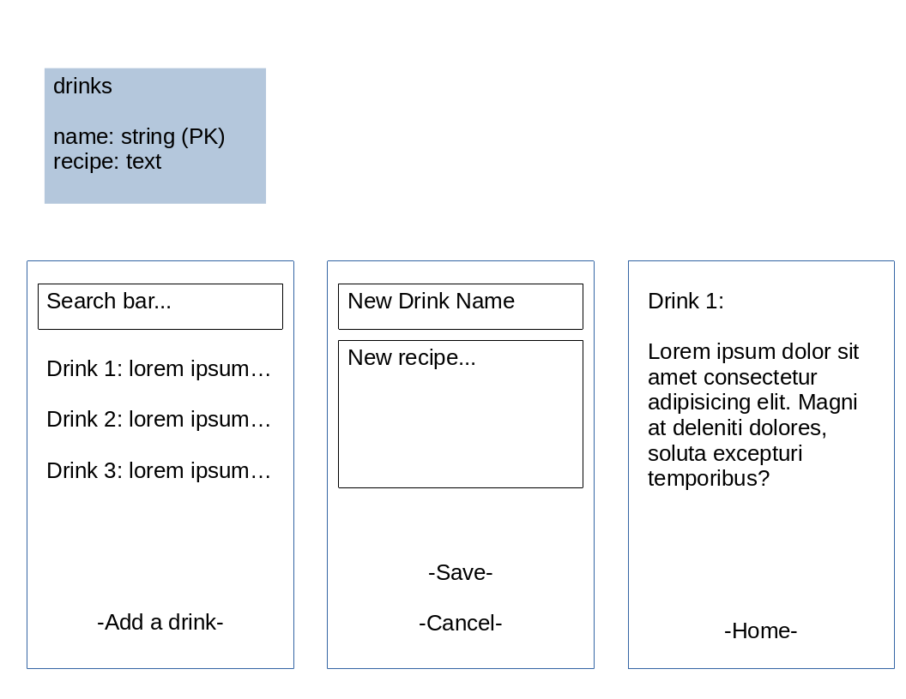

# Cocktail Guide

An app to find the perfect cocktail.

## Features

- Look up cocktail recipes based on style/ingredients
- Track last cocktails made
- Keep an inventory of bar ingredients

## MVP

- Front end app and managed database with CRUD

## TODOs

- :white_check_mark: create svelte app
- :white_square_button: create static routes for each view
- :white_square_button: create static "drinks" object and update routes to display dynamically
- :white_square_button: create DB with similar data
- :white_square_button: read data from database to display in app (READ functionality)
- :white_square_button: CREATE functionality
- :white_square_button: UPDATE functionality
- :white_square_button: DESTROY functionality
